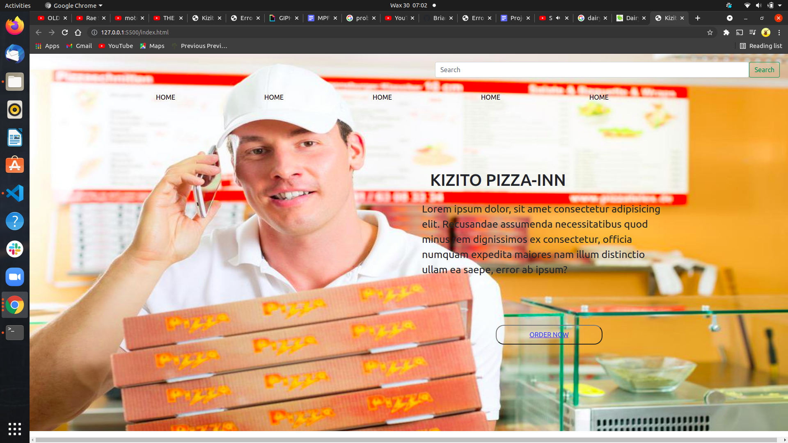

## **Kizito Pizza House**




## **Description**
####  Kizito Pizza House is here to help ease the and smoothen the process of you getting our services from a location of your choice and at any time  .
                    
                  


> The table bellow provide a list of our our Branches and location ..

| House | Location | Contacts | Link |
| ---   |  ---     | ---  | --- |
| KIZITO | Mombasa  | +254 7079 44 222| [Visit](https://briankhaifah.github.io/Facion-Industry/)
| KIZITO | Nyali  | +254 7079 44 222 | [Visit](https://briankhaifah.github.io/Facion-Industry/)
| KIZITO | Nairiobi  | +254 7079 44 222 | [Visit](https://briankhaifah.github.io/Facion-Industry/)
| KIZITO | kisumu  | +254 7079 44 222  |  [Visit](https://briankhaifah.github.io/Facion-Industry/)
| KIZITO | kitale  | +254 7079 44 222 | [Visit](https://briankhaifah.github.io/Facion-Industry/)
|       |        |       |

## **Contributors**
#### The website was worked on by : [**Brian Khaifah**](https://moringaschool.com/)


## **Setup/Installation**
* Clone the Repo.
    * ```
          git clone https://github.com/BrianKhaifah/-Delani-Studio.git

      ```

     * ```
          - Unzip the Clone file

          - Navigate int the unzip the file
           
* Open the project on vs code or your desired editor.

* Open the project on live Server.


##  **known Bugs**
#### Does not validate if email input is not an email.
#### Should come across any other issue share it with me via my,

Personal
[Email](brian.obuom@student.moringaschool.com)

## **Technology Used**
 * HTML

* CSS

* Javascript

* README.md


## **License**

#### Mt [**License**](https://choosealicense.com/licenses/mit/)

Copyright (c) 2021 [BrianKhaifah !](https://briankhaifah.github.io/Brian-s-Portfolio/)


